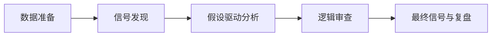
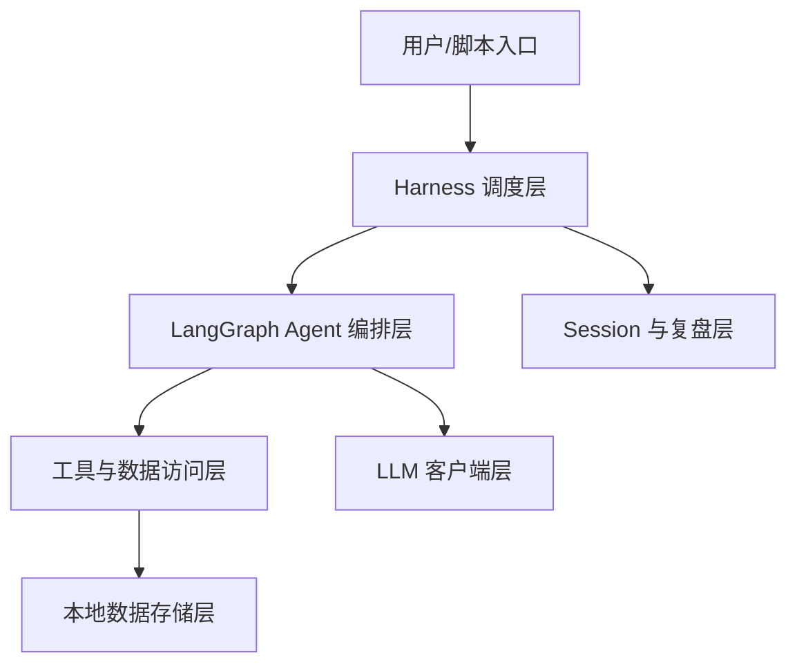

# A 股投资 Agent 系统产品说明

> 面向新用户的项目导览文档。  
> 信息来源：当前仓库代码、测试用例、`README.md`、`pyproject.toml`、`docs/learnings.md` 与项目架构梳理。  
> 适用时间：截至 2026-05-14。

## 1. 项目一句话

本项目是一个面向 A 股投研场景的多智能体信号发现与研究系统。它每日盘后主动从研报评级变化、板块异动、产业快讯等维度发现候选标的，再用 Kimi K2.6 驱动"假设驱动"分析引擎——先形成投资假设，再针对性取证验证，最终由 Critic 做逻辑挑战、Supervisor 汇总，输出可解释的投资研究结论。

项目不是一个自动下单机器人，而是一个"半自动信号发现与投研辅助系统"：它帮助用户主动发现有业务订单逻辑的标的、组织证据链、检验假设、识别风险，并把每天的分析过程沉淀为可复盘的记录。

## 2. 为什么需要这个项目

A 股投研决策面临四个核心问题：

1. **信息来源分散**：行情、财务、研报、公告、政策、龙虎榜、北向资金、新闻快讯分别来自不同渠道，整合成本极高。
2. **分析链条不稳定**：人工研究容易遗漏反证、过度依赖单一叙事，也难以每天稳定复盘。
3. **打分模式系统性错误**：传统多维评分系统（PE 分位×权重 + 技术面×权重 = 综合分）会系统性错过"产业逻辑型"标的。A 股重要的 alpha 来自叙事推理——"高 PE + 产业爆发初期"可能是正确定价，而非应该 reject 的信号。
4. **信号难以复用**：一次研究得到的判断、失败经验和风控规则，如果没有结构化沉淀，下次很难继续累积。

本项目的产品目标是把投研工作流程工程化：

- 用每日盘后数据预处理把高频使用的数据先拉取、清洗、入库。
- 用信号发现 pipeline 主动识别"值得深入研究"的候选标的（研报集中覆盖、板块异动、产业快讯聚类等）。
- 用"假设驱动"分析模式替代打分模式——先形成投资假设，再针对性取证验证，输出投资逻辑链而非分数。
- 用 Critic 对投资假设做结构化逻辑挑战（4 个维度：假设前提、证据质量、竞争替代、估值时机），降低单向乐观和叙事陷阱。
- 用 Supervisor 汇总成统一投资信号，便于模拟交易和复盘。
- 用 session、handoff、notes 把每天的判断留痕，形成长期积累。

## 3. 适合谁使用

本项目适合三类用户：

- 投资研究用户：希望用 AI 辅助完成个股分析、主题跟踪、风险排查和每日复盘。
- 量化/数据用户：希望把 tushare、akshare、DuckDB、回测和模拟盘串成可运行的研究流水线。
- 开发者：希望在 LangGraph 多智能体架构上扩展新的数据源、Agent、工具或风控模块。

它不适合完全没有 Python 环境、希望开箱即用图形界面、或希望系统直接给出"买卖答案"且不做人工复核的用户。

## 4. 产品工作逻辑

系统的核心逻辑可以概括为五步：



### 4.1 数据准备

盘后数据准备模块会拉取近期研报、政策、龙虎榜、机构席位、板块资金、快讯、涨跌停、板块指数、公告等信息，并写入本地 DuckDB。这样 Agent 在分析时不必每次都临时请求全部外部接口，而是优先使用本地结构化数据。

对应入口：

- `src/harness/daily_data_prep.py`
- `scripts/backfill_data.py`
- `scripts/backfill_announcements.py`

### 4.2 信号发现

系统每日盘后主动从 5 个维度扫描，输出"值得深入研究"的 5~10 只标的：

| 信号源 | 判断逻辑 |
|---|---|
| 研报评级变化 | 近 7 天 ≥3 家不同券商集中覆盖或含"买入/增持"评级 |
| 板块资金异动 | 连续 3 日净流入 >5 亿或单日 >10 亿的板块龙头 |
| 产业快讯聚类 | 近 3 天快讯中某产业链关键词（光模块/InP/算力等）出现 ≥5 次 |
| 业绩超预期 | 业绩预告同比增长 >30% |
| 游资/龙虎榜 | 知名游资席位当日净买入 >5000 万 |

同时输出市场温度（涨停家数→冰点/发酵/高潮/退潮 四阶段）。

对应入口：

- `src/harness/signal_discovery.py`

### 4.3 假设驱动分析

系统提供两条分析链路，可根据需要选择：

**链路 A：假设驱动模式（推荐）**  
适合信号发现触发的候选标的，或希望深入研究产业逻辑的场景。

```text
Phase 1（快速扫描）：基础数据 + 卖方一致预期 + 行业快讯
  → 输出：投资假设（1 句话）+ 3 个待验证问题 + 标的类型
Phase 2（针对性取证）：LLM 调用工具获取针对性数据
  → 工具包括：研报搜索、个股新闻、产业链映射、公告查询等
  → 输出：每个问题的验证结果（支持/证伪/待定 + 证据摘要）
Phase 3（逻辑判断）：综合正反证据形成结论
  → 输出：hypothesis_valid / confidence / evidence_for/against / position_type
Phase 4（Critic 逻辑审查）：对投资假设做结构化挑战
  → 输出：挑战清单 / adjusted_confidence / critic_recommendation
```

**链路 B：打分模式（传统）**  
适合批量筛选或快速概览多只标的。

```text
macro → fund → tech → event → flow_inst → flow_hot → risk → backtest → critic → supervisor
```

每个 Agent 各自负责一个分析视角，Supervisor 汇总后输出方向/信心/仓位。

核心文件：

- `src/harness/hypothesis_engine.py`（链路 A）
- `src/harness/orchestrator.py`（链路 B）

主要 Agent 对照表：

| Agent | 职责 |
|---|---|
| Macro | 宏观与主题环境 |
| Fund | 基本面、财务、主营业务（含 5 年业务结构变迁与突变率） |
| Tech | 技术面与价格行为 |
| Event | 公告、新闻、事件催化 |
| Flow Institutional | 机构资金与北向线索 |
| Flow Hot Money | 游资、龙虎榜和短线资金 |
| Risk | 风险敞口、止损、黑天鹅 |
| Backtest | 历史表现与策略验证 |
| Hypothesis Critic | 对投资假设做逻辑挑战（链路 A 专用） |
| Critic | 对打分结论做反向审查（链路 B） |
| Supervisor | 汇总判断，输出最终投资信号 |

### 4.4 逻辑审查（Critic）

系统有两种 Critic，对应两条链路：

**假设模式 Critic（`hypothesis_critic.py`）**  
收到的输入是投资假设+验证证据，从 4 个维度做结构化挑战：
1. **假设前提检验**：假设依赖的核心前提是否成立？
2. **证据质量检验**：正面证据是否可靠，是一手数据还是二手解读？
3. **竞争/替代检验**：是否忽略了竞争对手或替代技术？
4. **估值/时机检验**：当前价格是否已经反映了正面逻辑？

输出置信度调整（0~1）和建议（watch/satellite/core/avoid）。**高 PE 不自动否决**——判断"产业逻辑是否成立"而非"估值是否便宜"。默认 fallback 为 watch（而非 reject）。

**打分模式 Critic（`critic.py`）**  
收到各 Agent 的分析摘要，专门寻找已有结论中的问题（证据不足、只看利好、忽略风险、最坏情境等）。

### 4.5 最终信号与复盘

Supervisor 汇总所有分析结果后，输出最终投资信号。假设驱动模式的典型输出字段：

- `hypothesis`：投资假设（一句话）
- `hypothesis_valid`：假设是否经受住了挑战
- `confidence`：经 Critic 审查后的置信度（0~1）
- `position_type`：watch / satellite / core / avoid
- `evidence_for` / `evidence_against`：正反证据清单
- `key_risks`：关键风险
- `catalyst`：下一个催化剂时点

随后日度调度器可以把信号送入模拟交易模块，并保存 handoff、notes 和事件日志。

对应入口：

- `src/agents/supervisor.py`
- `src/harness/daily_runner.py`
- `src/sandboxes/execute/paper_trading.py`
- `src/session/`

## 5. 系统框架

从产品和工程视角看，项目可以分为六层：



### 5.1 用户入口层

用户主要通过脚本或 Python 函数运行系统：

- `scripts/run_analysis.py`：单标的分析示例。
- `scripts/run_batch.py`：批量运行。
- `scripts/run_paper_trading.py`：模拟交易。
- `scripts/run_5day.py`：多日运行。
- `scripts/_run_p15_*.py`：阶段性调试和验证脚本。

### 5.2 Harness 调度层

Harness 负责把"业务流程"组织起来：

- `orchestrator.py`：构建 LangGraph 主分析链路（链路 B 打分模式）。
- `daily_runner.py`：每日分析、黑天鹅检测、模拟交易、handoff。
- `daily_data_prep.py`：盘后数据预拉取。
- `hypothesis_engine.py`：假设驱动的四阶段分析流程（链路 A）。
- `signal_discovery.py`：盘后主动发现候选标的，5 个信号源 + 市场温度。

### 5.3 Agent 编排层

Agent 层是系统的"投研大脑"。每个 Agent 是一个相对独立的节点，接收共享状态，输出自己的结构化分析结果。

共享状态定义在：

- `src/agents/state.py`

Prompt 存放在：

- `src/agents/prompts/`（含 `hypothesis_phase1.md`、`hypothesis_phase2.md`、`hypothesis_phase3.md`、`hypothesis_critic.md` 等）

### 5.4 工具与数据访问层

Agent 不直接访问所有数据，而是通过工具层查询：

- 研报检索（含行业+个股双维度跨 7 天扫描）
- 政策检索
- 北向资金
- 龙虎榜与游资匹配
- 新闻快讯（个股级关键词检索）
- 公告查询
- 行业产业链关联股票
- 卖方一致预期（评级分布、目标价中位数）

核心文件：

- `src/tools/agent_tools.py`
- `src/tools/news_search.py`
- `src/tools/consensus.py`
- `src/sandboxes/data/industry_map.py`（21 条产业链 hardcode 映射，含上中下游关系）

### 5.5 数据存储层

本地数据主要使用 DuckDB，适合存放结构化市场数据、研报、政策、公告、事件和模拟交易数据。项目也声明了 LanceDB 与 sentence-transformers，用于知识库和向量检索能力扩展（规划中）。

典型路径：

- `data/duckdb/market.duckdb`
- `src/sandboxes/data/duckdb_store.py`（含 `query_safe` 参数化查询，防 SQL 注入）

`data/` 是本地数据目录，默认不提交到 Git。

### 5.6 LLM 与凭证层

LLM 客户端使用 OpenAI 兼容接口访问 Kimi：

- `src/llm_clients/kimi_sync.py`
- `src/llm_clients/kimi_batch.py`
- `src/llm_clients/tier_router.py`

凭证统一通过 `.env` 与 vault 读取：

- `src/vault/secrets.py`
- `src/vault/proxy.py`

不要把真实 API key、token 或本地 MCP 配置提交到 Git。

## 6. 两条核心使用路径

### 6.1 假设驱动分析（推荐）

适合信号发现触发的候选标的，或希望深入研究某只股票的产业逻辑。

```python
from harness.hypothesis_engine import run_hypothesis_analysis

result = run_hypothesis_analysis(
    ts_code="002428.SZ",
    trade_date="20260404",
    stock_name="云南锗业",
    trigger_reason="高品质磷化铟单晶片扩产公告，InP 衬底供不应求"
)
# result 包含：hypothesis / confidence / position_type / evidence_for / evidence_against
# / key_risks / catalyst / critic_challenges / critic_recommendation
```

### 6.2 盘后研究流水线

适合用户希望每天盘后自动更新数据、发现标的、形成第二天的研究候选。

建议流程：

```bash
python scripts/backfill_data.py
python scripts/backfill_announcements.py
python scripts/run_batch.py
python scripts/run_paper_trading.py
```

更细粒度的 Python 入口包括：

```python
from harness.daily_data_prep import run_daily_prep
from harness.signal_discovery import discover_signals
from harness.hypothesis_engine import run_hypothesis_analysis

run_daily_prep("20260430")
signals = discover_signals("20260430")
for sig in signals["signals"][:3]:  # 取前 3 个信号深入分析
    result = run_hypothesis_analysis(
        ts_code=sig["ts_code"],
        trade_date="20260430",
        stock_name=sig["stock_name"],
        trigger_reason=sig["trigger_detail"]
    )
```

## 7. 安装与配置

### 7.1 创建环境

```bash
python -m venv .venv
.venv\Scripts\activate
pip install -e ".[dev]"
```

Linux 或 macOS 使用：

```bash
source .venv/bin/activate
pip install -e ".[dev]"
```

### 7.2 配置环境变量

复制环境变量模板：

```bash
copy .env.example .env
```

需要填写：

```text
MOONSHOT_API_KEY=
TUSHARE_TOKEN=
LANGFUSE_PUBLIC_KEY=
LANGFUSE_SECRET_KEY=
LANGFUSE_HOST=http://localhost:3000
```

其中：

- `MOONSHOT_API_KEY`：Kimi / Moonshot API 密钥。
- `TUSHARE_TOKEN`：tushare Pro token（建议超级 VIP，以便使用研报、公告等高级接口）。
- `LANGFUSE_*`：可观测性配置，可按需启用。

### 7.3 运行测试

```bash
python -m pytest
```

当前仓库已有较完整测试覆盖，重点覆盖 Agent、数据工具、harness、LLM 客户端、Session、风控、回测和 tushare 扩展接口。

## 8. 输出结果如何理解

### 8.1 假设驱动模式输出

用户应把输出拆成四层理解：

1. **假设层**：`hypothesis` 是系统形成的一句话投资假设，`hypothesis_valid` 表示假设是否经受住了证据检验。
2. **证据层**：`evidence_for` / `evidence_against` 列出了支持和反对假设的具体证据条目，每条都有数据来源。
3. **风险层**：`key_risks` 列出了 Critic 挑战后识别的主要未验证风险，`critic_challenges` 提供了结构化的逻辑挑战明细。
4. **决策层**：`position_type`（watch/satellite/core/avoid）和 `confidence`（经 Critic 调整后的置信度）是最终建议。

一个高质量结论不等于"强烈买入"，而是"假设逻辑清晰、证据明确、风险已识别、仓位建议与置信度匹配"。

### 8.2 打分模式输出

- `direction`：买入、持有、观望等方向。
- `confidence`：信心程度。
- `position_pct`：建议仓位。
- `reasons`：核心理由。
- `summary`：简要结论。

## 9. 项目边界与风险

本项目是投研辅助工具，不构成投资建议，也不保证收益。

使用时需要注意：

- **数据覆盖不完整**：个股层面的公告正文、实时新闻、深度研报在预入库数据中可能缺失，建议结合实时补拉工具（`fetch_stock_reports`、`fetch_stock_news`）使用。
- 外部数据源可能延迟、缺字段、接口变更或返回空值。
- LLM 可能产生误判、幻觉或过度概括，投资假设需要人工复核。
- 回测结果不代表未来收益。
- 模拟交易不等同于真实交易，未覆盖滑点、冲击成本和极端流动性风险。
- A 股政策、停复牌、涨跌停、监管问询等事件可能导致模型假设失效。
- 最终决策必须由用户结合自身风险承受能力和人工复核完成。

## 10. 新用户建议阅读顺序

如果你是第一次接触项目，建议按这个顺序阅读：

1. `README.md`：了解安装和基础命令。
2. 本文档：理解产品目的、逻辑和系统框架。
3. `src/harness/signal_discovery.py`：理解信号是如何主动发现的。
4. `src/harness/hypothesis_engine.py`：理解假设驱动分析的四阶段流程。
5. `src/harness/orchestrator.py`：理解传统打分链路。
6. `src/agents/supervisor.py` 与 `src/agents/hypothesis_critic.py`：理解最终决策和逻辑审查。
7. `src/harness/daily_data_prep.py`：理解数据如何进入系统。
8. `src/tools/agent_tools.py`：理解 Agent 可以调用哪些工具。
9. `docs/learnings.md`：了解开发和运行中已经踩过的坑。

## 11. 一句话总结

这个项目的本质，是把 A 股投研中"主动发现有产业逻辑的标的、形成假设、取证验证、挑战逻辑、留下复盘"的过程产品化和工程化。它用信号发现代替被动等待，用假设驱动替代打分排名，用 Critic 逻辑挑战降低单向叙事风险，用数据和 session 机制让每一天的研究都能沉淀为下一次决策的基础。
